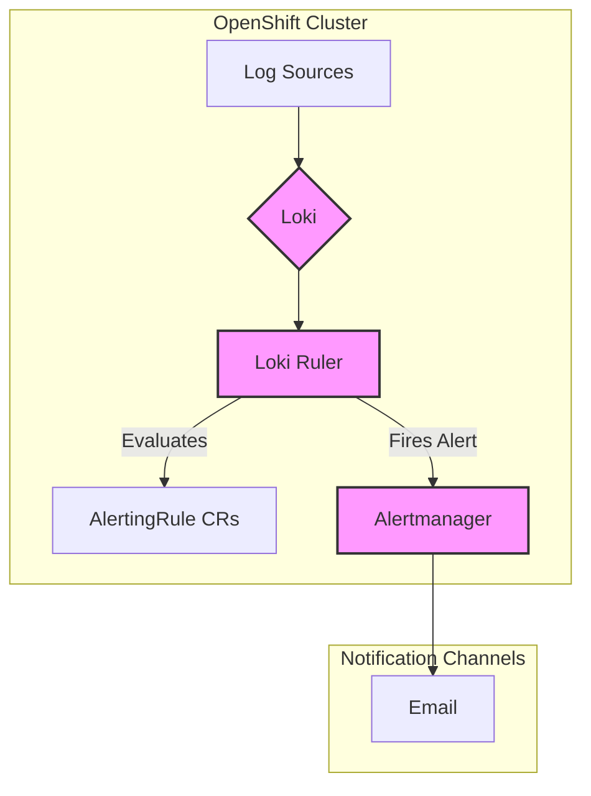

In the dynamic world of containerized applications running on OpenShift, managing and monitoring logs is crucial for maintaining system health and security. This guide explores how to configure and manage log-based alerts using the integrated LokiStack in an OpenShift 4.x environment, adopting a GitOps approach to handle alerting rules as code.

By leveraging Loki and native OpenShift Custom Resources (`AlertingRule`), you can define, track, and manage alerts in a declarative and version-controlled manner.

### The Alerting Workflow

The log-based alerting workflow in OpenShift follows a clear path from log generation to notification:



1.  **Log Sources**: Applications, infrastructure components, and audit services generate logs.
2.  **Loki**: Aggregates and indexes these logs.
3.  **Loki Ruler**: Continuously evaluates `AlertingRule` custom resources against the logs stored in Loki.
4.  **Alertmanager**: Receives alerts from the Loki Ruler and routes them to configured notification channels based on labels.

---

### 1. Enabling Loki-based Alerting

The first step is to enable the Loki Ruler component, which is responsible for evaluating alerting rules. This is a one-time setup performed by a Cluster Administrator.

**Prerequisites:**
*   You have `cluster-admin` privileges.
*   OpenShift Logging Operator version 5.7+ is installed.
*   The cluster is OpenShift version 4.13+.

**Procedure:**

Modify the `LokiStack` Custom Resource in the `openshift-logging` namespace to enable the rules component.

```yaml
# File: LokiStack/logging-loki.yaml
apiVersion: loki.grafana.com/v1
kind: LokiStack
metadata:
  name: logging-loki
  namespace: openshift-logging
spec:
  managementState: Managed
  size: 1x.small
  # --- Add or modify the 'rules' section ---
  rules:
    enabled: true
    selector:
      matchLabels:
        openshift.io/log-alerting: 'true'
    namespaceSelector:
      matchLabels:
        openshift.io/log-alerting: 'true'
```

*   `rules.enabled: true`: Activates the alerting engine.
*   `selector` & `namespaceSelector`: Configures the engine to automatically discover `AlertingRule` resources that have the label `openshift.io/log-alerting: 'true'`.

Apply the updated `LokiStack` configuration and verify that the `loki-ruler` pods are running.

```bash
oc get pods -n openshift-logging -l app.kubernetes.io/name=loki-ruler
```

---

### 2. Understanding Tenant IDs

OpenShift's Loki implementation is multi-tenant, providing isolated environments for different types of logs. The `tenantID` in an `AlertingRule` specifies which log store to query.

*   `tenantID: infrastructure`: For platform-level logs from core OpenShift and Kubernetes components.
*   `tenantID: audit`: For security-relevant audit logs.
*   `tenantID: application`: For logs generated by user applications within their projects.

> **Important**: This multi-tenancy ensures that queries for application logs do not mix with sensitive audit or infrastructure logs, providing a crucial layer of security and organization.

---

### 3. Configuring Alerting Rules

Once the alerting facility is enabled, administrators and developers can create `AlertingRule` resources.

#### Key Components of an `AlertingRule`

*   **alert**: A unique name for the alert.
*   **expr**: The LogQL query that is evaluated. If this expression returns a value, the alert is considered active.
*   **for**: A duration for which the `expr` must be true before the alert fires, preventing alerts from triggering on temporary spikes.
*   **labels**: Key-value pairs attached to the alert for routing, grouping, or adding severity information (e.g., `severity: critical`).
*   **annotations**: Additional information, like a `summary` or a `description`, to provide context in the alert notification.

#### 3.1. Administrator: Infrastructure & Audit Alerts

This procedure is for creating rules that monitor core platform components and security-relevant audit logs.

**Infrastructure Alert Example:**
This rule fires if the `kube-apiserver` installer pods log more than 10 errors per minute.

```yaml
# File: alerting-rules/infrastructure/kube-apiserver-alerts.yaml
apiVersion: loki.grafana.com/v1
kind: AlertingRule
metadata:
  labels:
    openshift.io/log-alerting: 'true'
  name: kube-apiserver-log-alerts
  namespace: openshift-kube-apiserver
spec:
  tenantID: infrastructure
  groups:
  - name: installer-alerts
    rules:
    - alert: HighFailureErrors
      expr: |
        sum(rate({kubernetes_namespace_name="openshift-kube-apiserver", kubernetes_pod_name=~"installer.*"} |= "error" [1m])) > 10
      for: 10s
      labels:
        severity: critical
      annotations:
        summary: High kube-apiserver installer errors.
        description: A high amount (more than 10) of installer errors accumulated over the last 10s.
```
> **Note**: `AlertingRule` resources for the `infrastructure` tenant must be placed in an `openshift-*`, `kube-*`, or `default` namespace.

**Audit Alert Example:**
This rule fires if more than 100 authentication failures are recorded over a 10-minute period.

```yaml
# File: alerting-rules/audit/authentication-alerts.yaml
apiVersion: loki.grafana.com/v1
kind: AlertingRule
metadata:
  labels:
    openshift.io/log-alerting: 'true'
  name: kube-apiserver-audit-alerts
  namespace: openshift-logging
spec:
  tenantID: audit
  groups:
  - name: kube-apiserver-audit-alerts
    rules:
    - alert: HighAuthenticationFailed
      expr: |
        sum(rate({log_type="audit"} |~ "auth failed" [1m])) > 100
      for: 10m
      labels:
        severity: critical
      annotations:
        summary: High Authentication Failures.
        description: A high amount (>100) of authentication failures occurred over the last 10m.
```
> **Note**: `AlertingRule` resources for the `audit` tenant must be placed in the `openshift-logging` namespace.

#### 3.2. Developer: Application Alerts

This procedure is for creating rules that monitor application-specific logs.

**Prerequisites:**
*   The developer has permissions to create `AlertingRule` resources in their project namespace.
*   The project namespace and the `AlertingRule` resource are both labeled to match the `namespaceSelector` and `selector` in the `LokiStack` CR (e.g., `openshift.io/log-alerting: 'true'`).

**Application Alert Example:**
This rule fires if an application server logs more than 10 errors per minute.

```yaml
# File: alerting-rules/my-app/server-errors.yaml
apiVersion: loki.grafana.com/v1
kind: AlertingRule
metadata:
  labels:
    openshift.io/log-alerting: 'true'
  name: my-app-server-alerts
  namespace: my-app-namespace
spec:
  tenantID: application
  groups:
  - name: my-app-server-alerts
    rules:
    - alert: HighAppServerErrors
      expr: |
        sum(rate({kubernetes_namespace_name="my-app-namespace", kubernetes_pod_name=~"my-app-server.*"} |= "error" [1m])) > 10
      for: 10s
      labels:
        severity: warning
      annotations:
        summary: High application server errors.
        description: A high amount (more than 10) of my-app server errors have been logged in the last 10 seconds.
```

---

### 4. Validation

After an alert has been configured, you can validate that it is working as expected.

1.  **Check the Rules Page**:
    *   Navigate to **Observe -> Alerting -> Rules** in the OpenShift Console.
    *   Filter by **AlertingRule** to see if your newly created rules have been discovered.

2.  **Check the Alerts Page**:
    *   Navigate to **Observe -> Alerting -> Alerts**.
    *   When an alert's condition is met, it will appear in the "Firing" list.

3.  **Trigger a Test Alert**:
    *   You can trigger a test alert by generating log entries that match an alert's `expr` to confirm that the alert fires.

---

### 5. Best Practices

*   **Be Specific in Queries**: Use labels like `kubernetes_namespace_name` and `kubernetes_pod_name` to narrow the scope of your query. This improves performance and reduces the chance of false positives.
*   **Use `rate()` for Frequent Events**: For high-volume log entries, use `rate()` and `sum()` to aggregate results over a time window instead of matching every single line.
*   **Set Appropriate `for` Durations**: Use the `for` field to prevent "flapping" alerts caused by transient issues. A duration of 5-10 minutes is often a good starting point.
*   **Leverage Labels for Grouping**: Use labels (`severity`, `team`, `priority`) consistently to group related alerts.
*   **Embrace GitOps**: Store your `AlertingRule` resources in Git to maintain a version-controlled, auditable history of your monitoring configuration.

By following these steps, you can effectively implement a robust, version-controlled log-based alerting system in your OpenShift environment using Loki.

---

### 6. References

*   **[OpenShift Logging Documentation](https://docs.redhat.com/en/documentation/red_hat_openshift_logging/6.3)**: Official Red Hat documentation for the Loki-based logging stack.
*   **[Grafana Loki Documentation](https://grafana.com/docs/loki/latest/)**: Comprehensive documentation for Grafana Loki.
*   **[LogQL Query Language](https://grafana.com/docs/loki/latest/logql/)**: Detailed guide on Loki's query language for writing effective alert expressions.